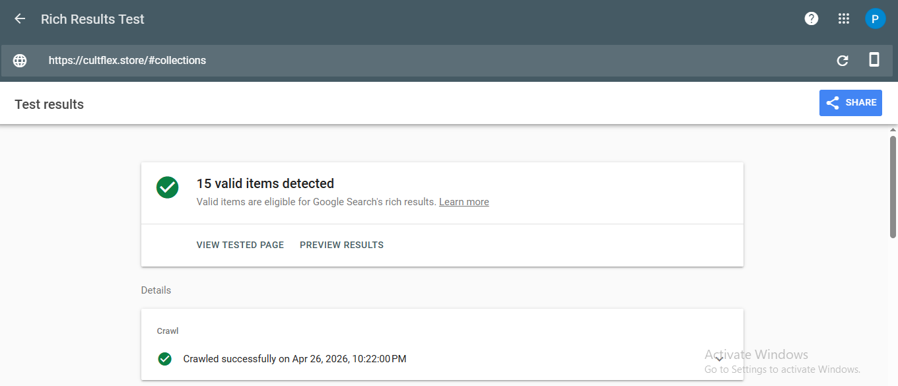
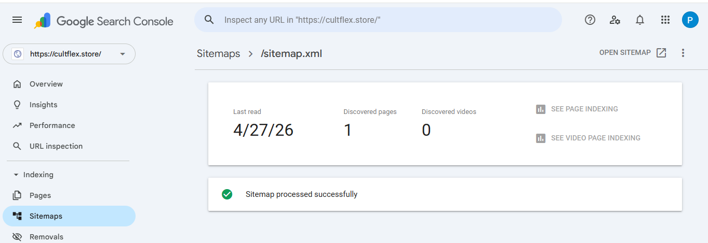

# CultFlex — Customizable Fits. Infinite Flex.

> A fashion e-commerce front-end project built with HTML, CSS & JavaScript — hosted on GitHub Pages.

## About the Project

CultFlex is a mock fashion e-commerce website designed and developed as a personal portfolio project. It simulates a real streetwear brand — featuring product listings, a functional cart, category filtering, and a complete checkout flow — all built without any frameworks or backend.

The project was built to demonstrate practical skills in front-end web development, UI/UX design, and digital marketing setup (SEO, analytics).

---

## Live Demo

[View CultFlex →](https://cultflex.store/)

---

## What's Built

- Multi-page single-page application (SPA) using vanilla JavaScript
- Product catalogue with category filters — Oversized, Hoodies, Graphic, Limited Edition
- Product detail view with size selector, colour swatches, and quantity control
- Add to cart, cart management, and mock checkout flow
- Search functionality across all products
- Fully responsive design — mobile and desktop
- Dark-themed UI with custom animations and scroll effects

---

## SEO & Digital Marketing Setup

This project includes a complete on-page SEO implementation:

| SEO Element | Details |
|---|---|
| Title tag | Keyword-targeted, under 60 characters |
| Meta description | 155 characters, includes primary keyword |
| Canonical URL | Set to GitHub Pages live URL |
| Robots meta | `index, follow` |
| Open Graph tags | Full setup — title, description, image, url, locale |
| Twitter Card | `summary_large_image` format |
| Schema Markup | `ClothingStore` + `ItemList` with 6 products |
| Google Analytics 4 | Connected — tracking organic visits |
| Google Search Console | Sitemap submitted, pages indexed |

**Lighthouse Scores** *(after SEO upgrades)*

| Metric | Score |
|---|---|
| Performance | 67 |
| Accessibility | 81 |
| Best Practices | 96 |
| SEO | 91 |

---

### Project Proof — Screenshots

**1. Lighthouse Audit Report**

> Run at [web.dev/measure](https://web.dev/measure)  → Lighthouse tab
> Screenshot shows Performance · Accessibility · Best Practices · SEO Score


---

**2. Google Rich Results Test — Schema Markup Verified**

> Tested at [search.google.com/test/rich-results](https://search.google.com/test/rich-results)
> Shows `ClothingStore` and `ItemList` passing with 15 products detected



---

**3. Google Search Console — Sitemap Submitted**

> sitemap.xml submitted and accepted — pages queued for indexing
> Coverage report submitted (format-excel sheet)


📥 [Download Coverage Report (Excel)](screenshots/coverage%20report%20for%20project.xlsx)

---

**4. Google Analytics 4 — Realtime Dashboard**

> GA4 connected via gtag script — tracking live sessions without any paid traffic


---


## Tech Stack

- HTML5, CSS3, Vanilla JavaScript
- Google Fonts — Bebas Neue, Rajdhani, Orbitron, Space Mono
- Font Awesome 6 — icons
- Lucide Icons
- GitHub Pages — hosting

---

## Project Structure

```
cultflex/
├── index.html          # Main file — entire SPA lives here
├── images/             # All product and banner images
│   ├── o1.jpg - o8.jpg # Oversized tee images
│   ├── h1.jpg - h5.jpg # Hoodie images
│   ├── g1.jpg - g9.jpg # Graphic tee images
│   └── l1.jpg - l4.jpg # Limited edition images
├── sitemap.xml         # Submitted to Google Search Console
└── README.md
```

---

## Key Learnings

- Implemented Schema.org structured data (`ClothingStore`, `Product`, `ItemList`) and verified it using Google's Rich Results Test
- Understood the difference between on-page SEO in a CMS (plugins) vs. raw HTML (manual `<head>` implementation)
- Connected GA4 to a static site by embedding the gtag script — no server or plugin required
- Improved Lighthouse SEO score by adding canonical tags, robots meta, and complete Open Graph setup

---

## How to Run Locally

```bash
# Clone the repository
git clone https://github.com/userprince17/CULTFLEX.git

# Open in browser — no server needed
open index.html
```

Or just open `index.html` directly in any browser.


---

## Author

**Prince Kumar V**
2nd Year BBA — Faculty of Management, SRMIST, KATTANKULATHUR, CHENNAI,TAMIL NADU
[LinkedIn →](https://www.linkedin.com/in/prince-kumar-203360323?utm_source=share_via&utm_content=profile&utm_medium=member_android) 
· [GitHub →](https://github.com/userprince17)

---

*This is a portfolio/academic project. CultFlex is not a real business and does not process real payments.*
